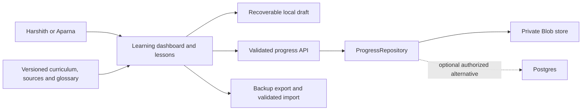

# Ascent architecture and data design

This design is intentionally for a small trusted personal learning app. It does not turn name selection into authentication. The enterprise-agent architecture taught in the lessons has stronger identity requirements than this portal.

## Application boundaries



The Python agent labs run separately on the learner's machine or chosen cloud. The portal serves instructions and records evidence; it does not run arbitrary lab code or call a model to generate lessons.

## Suggested structure

```text
app/
  page.tsx                         profile choice
  learn/page.tsx                   dashboard
  learn/course/page.tsx            30-day course map
  learn/day/[day]/page.tsx          lesson workspace
  learn/resources/page.tsx
  learn/glossary/page.tsx
  learn/project/page.tsx
  learn/settings/page.tsx
  api/progress/route.ts
  api/profile/route.ts             optional signed profile selection cookie
components/
  lesson/ progress/ resources/ learning-aids/
content/
  curriculum.json sources.json glossary.json
lib/
  content/schema.ts validation.ts selectors.ts
  progress/schema.ts reducer.ts repository.ts
  progress/blob-repository.ts local-repository.ts
  progress/backup.ts completion.ts
tests/
  content/ progress/ storage/ e2e/
```

Adapt this to the existing project's conventions rather than forcing a second scaffold into a working app.

## Content schema

curriculum.json is the source of truth and includes schemaVersion, contentVersion and stable lesson/task IDs. Import and validate it at build time. Do not mutate it through learner APIs.

A Lesson contains day, id, title, bridge, explain, analogy, topics, goals, prerequisites, estimated minutes, lab steps/checks/evidence prompt, quiz, resourceAssignments, optional stretch and tasks. Keep these fields rather than flattening content to a description.

sources.json records source IDs, descriptive URLs, publisher, type, assignment, why selected, dates and limitations. Glossary definitions reference source IDs and lesson numbers.

Display resource assignments by role: selected core resources first, other references and research in an optional section. A resource can support multiple lessons without being marked globally complete by a click.

## Learner state schema

Suggested TypeScript contract (refine with runtime schemas):

```ts
type ProfileId = "harshith" | "aparna";
type Competency = "explain" | "guided" | "independent" | "extend";
type DayState = {
  completedTaskIds: string[];
  acceptanceChecks: Record<string, boolean>;
  notes: string;
  evidence: { text: string; links: string[]; execution: "actual" | "mock" | "not-run" | "mixed" };
  reflection: string;
  checkpoint: { answer: string; reviewed: boolean; understood: boolean | null };
  competency: Competency | null;
};
type StudySession = {
  id: string;
  lessonId: string;
  localDate: string;
  timezone: string;
  minutes: number;
  createdAt: string;
  updatedAt: string;
};
type LearnerState = {
  schemaVersion: 1;
  contentVersion: string;
  profileId: ProfileId;
  days: Record<string, DayState>;
  sessions: StudySession[];
  settings: { weeklyTargetMinutes: number; timezone: string };
  lastLocation: { lessonId: string; taskId?: string } | null;
  updatedAt: string;
};
type StoredProgress = {
  state: LearnerState;
  revision: string | null;
  storageMode: "local" | "blob" | "postgres";
};
```

Use stable IDs for acceptance checks, such as day-01-check-1, while preserving supplied task IDs. Timestamps should come from trusted server time for cloud writes; local dates are learner-context values, not inferred from UTC string slicing.

Derive progress from data; do not store a second mutable percentage that can drift. Deduplicate task IDs and sessions. Bound note lengths, URLs and total payload size with explicit, friendly validation messages.

Suggested caps: 1 MiB backup/request, 20,000 characters per notes field, 10,000 per evidence/reflection, 20 links per day, sessions 1–720 minutes, and a bounded total session count with archival guidance. These are application design choices, not provider limits.

## Progress API

GET returns the current selected-profile state, revision and truthful storage mode with private, no-store caching behavior.

PUT accepts the selected profile's validated state plus expected revision. Validate every lesson/task ID against the loaded content and enforce body limits. A successful update returns the persisted state and new revision. A stale update returns HTTP 409 plus enough information to reconcile, never a false success.

If a signed profile cookie is used, its purpose is request consistency, not proof of learner identity. The profile-selection endpoint still allows either known name. Validate Origin for mutations and use suitable cookie settings; do not permit arbitrary profile paths or blob names.

Use clear structured errors for invalid input, storage unavailable, conflict and unexpected failure. Do not log raw notes or secrets.

## Private Blob adapter

Use a fixed namespace per profile, for example ascent/progress/v1/harshith.json. All operations run server-side. Inspect the installed SDK types and current [Vercel Blob SDK documentation](https://vercel.com/docs/vercel-blob/using-blob-sdk) before coding.

Use private access, a fresh read with documented cache bypass, and the object ETag as the concurrency revision. Existing-object saves use conditional writes. First creation disallows overwrite; a creation collision becomes a conflict. Do not transform missing credentials, forbidden access or transient errors into an empty profile.

Keep the initial UI state loading until the authoritative read completes. Otherwise an initial empty save can erase existing work.

Use the configured SDK authentication mechanism from the connected project; never expose credentials to the browser. [Private Blob storage guidance](https://vercel.com/docs/vercel-blob/private-storage) is separate from application identity.

For conflicting state, retain base, local draft and latest remote version. Nonoverlapping task changes may be merged only with a documented three-way merge. Notes changed on both sides require explicit resolution. A simple initial conflict UI can offer 'review remote and copy my draft' plus retry; never silently discard either version.

This snapshot design fits two low-volume profiles. It is not a recommended event database for large cohorts. If requirements expand to many writers, querying or transactional workflows, an already-authorized [Marketplace Postgres integration](https://vercel.com/docs/marketplace-storage) can implement the same interface.

## Local adapter and recovery

Use namespaced browser storage or IndexedDB for local mode, with schema validation and corruption recovery. Clearly say 'Saved on this device'. Do not send a local empty state to overwrite cloud state when credentials later become available.

Keep a local draft queue in cloud mode as recovery, separate from confirmed cloud state. Debounce notes, serialize saves and ignore stale response generations after profile switches. A late Harshith response cannot populate Aparna's UI.

Warn before replacing or resetting state. Backups contain version, profile and export timestamp. Imported URLs must use safe protocols; render note text safely and never execute embedded HTML or code.

## Learning aids

- Context budget: editable assumed capacity and categories; subtraction computes remaining capacity. Explicitly label example counts. A real tokenizer is optional and must name its model; don't approximate while claiming exactness.
- Weighted sum: editable features and weights, computed output, clear dimensions.
- Attention: small fixed tensors, optional causal mask and normalized score table, with accessible text explanation.
- Architecture diagrams: simple Mermaid or semantic SVG diagrams with text alternatives for RAG, agent loop, graph categories and enterprise boundaries.

These are pedagogical aids, not mocked live AI services.

## Verification and deployment

Unit tests cover completion rules, IDs, time/session totals, backup migration and merge/conflict decisions. Integration tests cover request validation, profile namespaces, concurrency, initialization and storage failures using a fake adapter; configured Blob receives a separate real smoke test.

End-to-end tests cover profile selection, lesson navigation, notes, task toggles, reload, switching profiles, backup and responsive use. Browser/accessibility checks belong to the Kiro implementation work and must actually run before being claimed.

Build the production app. Deploy a Vercel preview only when the correct project and storage target are known. If storage credentials are absent, report local mode and exact next setup step; do not fabricate a cloud test. No secrets or account identifiers are supplied in this specification.

